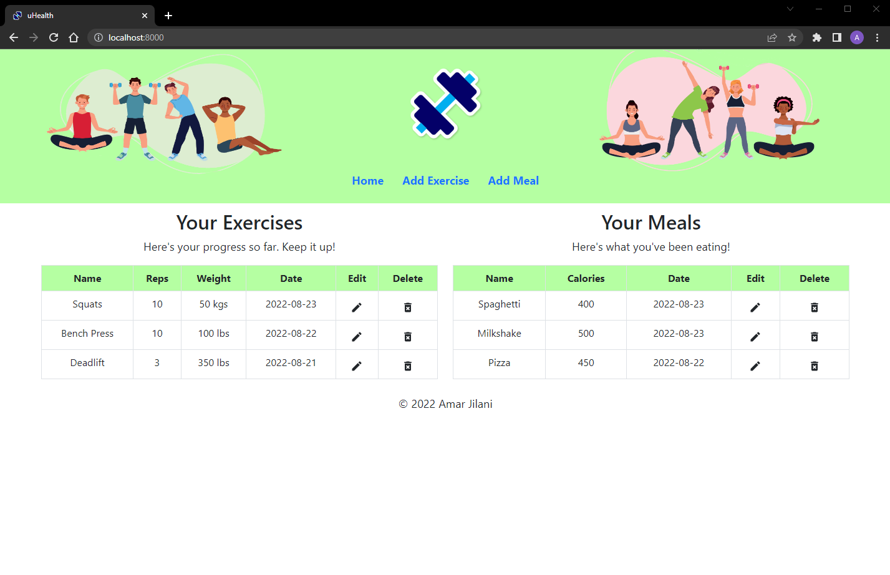

 

  

<h1 align="center">uHealth</h1>

Health and wellness web application created using the MERN stack!

## About The Project

uHealth is a web application that provides a simple interface for easy tracking of your workouts and meals! 

### Built With:

